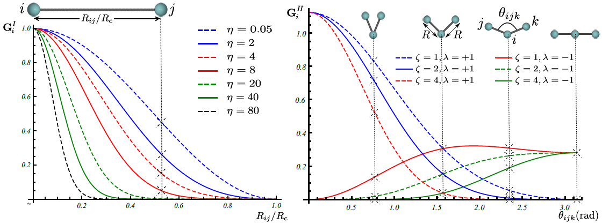
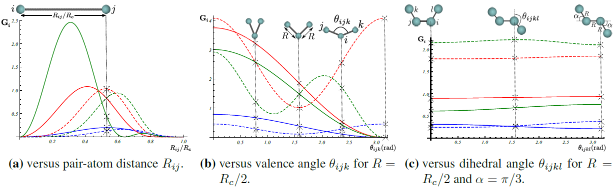

.. _theory:

==================================
Theory
==================================

According to Born-Oppenheimer approximation, the potential energy of an atomic configuration
can be assumed as a function of only nuclei positions. Potential energy is in general a very
complicated function that in theory can be found by directly solving the Schrodinger
equation. However, in practice, exact analytical solution to the many-body Schrodinger
equation is very difficult (if not impossible). Taking into account this fact, the idea is
then to approximate the potential energy with a regression model:

.. math::
  \textbf{R}\xrightarrow{\text{regression}}E=E(\textbf{R}),

where :math:`\textbf{R}` is the position of atoms in the system.

-----------------------------------------
Atomic representation of potential energy
-----------------------------------------

In order to have a potential function which is simultaneously applicable to systems of
different sizes, the total potential energy of the system can to be broken up into atomic
energy contributions:

.. math::
  E(\textbf{R})=\sum_{\text{atom}=1}^{N}E_\text{atom}(\textbf{R}).

The above expansion can be justified by assembling the atomic configuration by bringing
atoms close to each other one by one. Then the atomic energy contributions can be
approximated using a regression method:

.. math::
  \textbf{R}\xrightarrow{\text{regression}}E_\text{atom}=E_\text{atom}\left(\textbf{R}\right).

----------
Descriptor
----------

A better interpolation can be achieved if an appropriate symmetry function :math:`\textbf{G}`
of atomic coordinates, approximating the functional dependence of local energetics, is used
as the input of regression operator:

.. math::
  \textbf{R}\xrightarrow{\textbf{G}}\textbf{G}\left(\textbf{R}\right)\xrightarrow{\text{regression}}E_\text{atom}=E_\text{atom}\left(\textbf{G}\left(\textbf{R}\right)\right).

******
Gaussian
******

Gaussian descriptor :math:`\textbf{G}` as a function of pair-atom distances and
three-atom angles, has been suggested by Behler [1], and is implemented within
Amp. Radial fingerprint of Gaussian type captures interaction of atom
:math:`i` with all atoms :math:`j` as the sum of Gaussians with width
:math:`\eta` and center :math:`R_s`,

.. math::
  G_{i}^{I}=\sum^{\tiny{\begin{array}{c} \text{atoms j within }R_c\\
  \text{ distance of atom i}
  \end{array}}}_{j\ne i}{e^{-\eta(R_{ij}-R_s)^2/R_c^2}f_c\left(R_{ij}\right)}.

The next type is the angular fingerprint accounting for three-atom
interactions. Gaussian angular fingerprint is computed for all triplets of
atoms :math:`i`, :math:`j`, and :math:`k` by summing over the cosine values of
the angles :math:`\theta_{ijk}=\cos^{-1}\left(\displaystyle\frac{\textbf{R}_{ij}.\textbf{R}_{ik}}{R_{ij}R_{ik}}\right)`,
(:math:`\textbf{R}_{ij}=\textbf{R}_{i}-\textbf{R}_{j}`), centered at atom :math:`i`,
according to

.. math::
  G_{i}^{II}=2^{1-\zeta}\sum^{\tiny{\begin{array}{c} \text{atoms j, k within }R_c\\
  \text{ distance of atom i}
  \end{array}}}_{\scriptsize\begin{array}{c}
  j,\,k\ne i \\
  (j\ne k) \end{array}}{\left(1+\lambda \cos \theta_{ijk}\right)^\zeta
  e^{-\eta\left(R_{ij}^2+R_{ik}^2+R_{jk}^2\right)/R_c^2}f_c\left(R_{ij}\right)f_c\left(R_{ik}\right)f_c\left(R_{jk}\right)},

with parameters :math:`\lambda`, :math:`\eta`, and :math:`\zeta`. The function
:math:`f_c\left(R_{ij}\right)` in the above equations is the cutoff function defining the
energetically relevant local environment with value one at :math:`R_{ij}=0` and zero at
:math:`R_{ij}=R_{c}`, where :math:`R_c` is the cutoff radius. In order to have a continuous
force-field, the cutoff function :math:`f_c\left(R_{ij}\right)` as well as its first
derivative should be continuous in :math:`R_{ij}\in\left[0,\infty\right)`. One possible
expression for such a function as proposed by Behler [1] is

.. math::
    f_{c}\left(R_{ij}\right)==
    \begin{cases}
    &0.5\left(1+\cos\left(\pi\displaystyle\frac{R_{ij}}{R_c}\right)\right)\qquad \text{for}\;\: R_{ij}\leq R_{c},\\
    &0\qquad\qquad\qquad\qquad\quad\quad\quad\:\: \text{for}\;\: R_{ij}> R_{c}.\\
    \end{cases}

Figure below shows how components of fingerprints :math:`\textbf{G}_{i}^{I}` and
:math:`\textbf{G}_{i}^{II}` change with, respectively, distance :math:`R_{ij}` between
pair atoms :math:`i` and :math:`j` and valence angle :math:`\theta_{ijk}` between triplet of
atoms :math:`i`, :math:`j`, and :math:`k` with central atom :math:`i`:

******
Zernike
******

Three-dimensional Zernike descriptor is also available inside Amp, and can be
used as the atomic environment descriptor. Zernike-type descriptor has been
previously used in the machine-learning community extensively, but it has been
suggested here as the first time for representing chemical local environment.
Zernike moments are basically a tensor product between spherical harmonics
complete and orthogonal on the surface of unit sphere, and Zernike polynomials
complete and orthogonal within the unit sphere. Zernike descriptor components
for each integer degree are then defined as the norm of Zernike
moments with the same corresponding degree. For more details on the Zernike
descriptor the reader is referred to the nice paper of Novotni and Klein [2].

Inspired by Bartok et. al. [3], to represent the local chemical environment of
atom :math:`i`, an atomic density function :math:`\rho_{i}(\mathbf{r})` is
defined for each atomic local environment as the sum of delta distributions
shifted to atomic positions:

.. math::
    \rho_{i}(\mathbf{r}) = \sum_{j\neq
    i}^{\tiny{\begin{array}{c} \text{atoms j within }R_c\\
    \text{ distance of atom i}
    \end{array}}}\eta_{j}\delta\left(\mathbf{r}-\mathbf{R}_{ij}\right)f_{c}\left(\|\mathbf{R}_{ij}\|\right),

Next components of Zernike descriptor are computed from Zernike moments of the
above atomic density destribution for each atom :math:`i`.

Figure below show how components of Zernike descriptor vary with pair-atom
distance, three-atom angle, and four-atom dehidral angle. It is important to
note that components of the Gaussian descriptor discussed above are
non-sensitive to the four-atom dehidral angle of the following figure.

******
Bispectrum
******

Bispectrum of four-dimensional spherical harmonics have been suggested by
Bartok et al. [3] to be invariant under rotation of local atomic environment.
In this approach, the atomic density distribution defined above is first mapped
onto the surface of unit sphere in four dimensions. Consequently, Bartok et al.
have shown that the bispectrum of this mapping can be used as atomic
environment descriptor. We refer the reader to the original paper [3] for
mathematical details. Worth to mention that this approach of describing local
environment is also available inside Amp.

----------------
Regression Model
----------------

The general purpose of the regression model :math:`x\xrightarrow{\text{regression}}y`
with input :math:`x` and output :math:`y` is to approximate the function
:math:`y=f(x)` by using sample train data points :math:`(x_i, y_i)`.
The intent is to later use the approximated :math:`f` for input data
:math:`x_j` (other than :math:`x_i` in the train data set), and make
predictions for :math:`y_j`. Typical regression models include, but are not
limited to, Gaussian processes, support vector regression, and neural network.

********************
Neural network model
********************

Neural network is basically a very simple model of how the nervous system processes
information. The first mathematical model was developed in 1943 by McCulloch and Pitts [4]
for classification purposes; biological neurons either send or do not send a signal to the
neighboring neuron. The model was soon extended to do linear and nonlinear regression, by
replacing the binary activation function with a continuous function. The basic functional
unit of a neural network is called "node". A number of parallel nodes constitute a layer.
A feed-forward neural network consists of at least an input layer plus an output layer.
When approximating the PES, the output layer has just one neuron representing the potential
energy. For a more robust interpolation, a number of "hidden layers" may exist in the neural
network as well; the word "hidden" refers to the fact that these layers have no physical
meaning. A schematic of a typical feed-forward neural network is shown below. In each node
a number of inputs is multiplied by the corresponding weights and summed up with a constant
bias. An activation function then acts upon the summation and an output is generated. The
output is finally sent to the neighboring neuron in the next layer. Typically used
activation functions are hyperbolic tangent, sigmoid, Gaussian, and linear function. The
unbounded linear activation function is particularly useful in the last hidden layer to
scale neural network outputs to the range of reference values. For our purpose, the output
of neural network represents energy of atomic system.

.. image:: _static/nn.png
   :scale: 05 %
   :align: center

**References:**

1. "Atom-centered symmetry functions for constructing high-dimensional neural network potentials", J. Behler, J. Chem. Phys. 134(7), 074106 (2011)

2. "Shape retrieval using 3D Zernike descriptors", M. Novotni and R. Klein, Computer-Aided Design 36(11), 1047--1062 (2004)

3. "Gaussian approximation potentials: The accuracy of quantum mechanics, without the electrons", A.P. Bart\'ok, M.C. Payne, R. Kondor and G. Csanyi, Physical Review Letters 104, 136403 (2010)

4. "A logical calculus of the ideas immanent in nervous activity", W.S. McCulloch, and W.H. Pitts, Bull. Math. Biophys. 5, 115--133 (1943)
